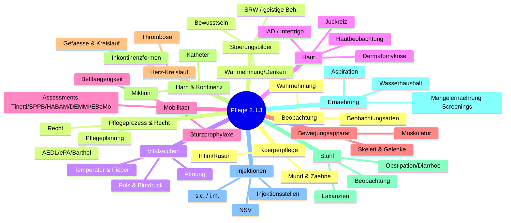

# Themenkarte – Pflegeausbildung 2. Lehrjahr (generalistisch, NRW)

Überblick über alle 108 Kurs-Dokumente, gebündelt in **13 klausurrelevante Themen-Kategorien**.
Jede Kategorie fasst inhaltlich zusammengehörige Dateien zusammen (inkl. Dubletten wie IAD, Intertrigo,
Juckreiz, EBoMo oder mehrfacher Injektions-/Blutdruck-Materialien). Assessments und Skalen stehen jeweils
in ihrer Fachkategorie. Einige Dokumente sind bewusst mehreren Kategorien zugeordnet (Querbezüge unten).

---

## Kategorien im Überblick

| Nr. | Kategorie | Schwerpunkt |
|-----|-----------|-------------|
| 1 | Beobachtung & Wahrnehmung | Grundlagen der Krankenbeobachtung |
| 2 | Bewusstseins-, Wahrnehmungs- & Denkstörungen | Psychopathologie / neurologische Störungen |
| 3 | Vitalzeichen (Puls, Blutdruck, Temperatur/Fieber, Atmung) | Messung & Beobachtung der Vitalparameter |
| 4 | Haut & Hauterkrankungen | Hautbeobachtung, Dermatosen, feuchtigkeitsbedingte Schäden |
| 5 | Bewegung, Sturz & Mobilität (Assessments) | Mobilitätsförderung, Sturzprophylaxe, Bettlägerigkeit |
| 6 | Bewegungsapparat – Anatomie & Physiologie | Skelett, Muskulatur, Gelenke |
| 7 | Herz-Kreislauf-System & Thrombose | Gefäßanatomie, Kreislauf, Thrombose(prophylaxe) |
| 8 | Ausscheidung: Harn, Kontinenz & Blasenkatheter | Miktion, Inkontinenzformen, Katheter |
| 9 | Ausscheidung: Stuhl & Laxanzien | Stuhlbeobachtung, Obstipation, Diarrhoe, Abführmittel |
| 10 | Ernährung & Flüssigkeit (Screenings & Aspiration) | Mangelernährung, Wasserhaushalt, Aspirationsprophylaxe |
| 11 | Injektionen & Arzneimittelapplikation | s.c./i.m., Injektionsstellen, NSV |
| 12 | Körper-, Mund- & Zahnpflege | Grundpflege, Intimpflege, Rasur, Mundhygiene |
| 13 | Pflegeprozess, Assessments & Recht | Pflegeplanung, AEDL/ePA, Barthel, Rechtsgrundlagen |

---

## 1. Beobachtung & Wahrnehmung
Grundlagen der Wahrnehmung, systematische Beobachtung und Datenerhebung – das methodische Fundament aller
Vitalzeichen-, Haut- und Bewegungsbeobachtungen.

**Unterthemen:** Wahrnehmungsprozess & Sinne · optische Täuschungen · systematische Beobachtung (5 Schritte) ·
objektive vs. subjektive Daten · Selbst-/Fremd-, teilnehmende/nichtteilnehmende Beobachtung.

- 001-wahrnehmung-und-beobachtung.md
- 088-arten-von-beobachtung.md

## 2. Bewusstseins-, Wahrnehmungs- & Denkstörungen
Psychopathologische und neurologische Störungsbilder (überwiegend Tafelbilder).

**Unterthemen:** Wahrnehmungsstörung (Halluzination/Illusion) · Orientierungsstörung & Verwirrtheitsprophylaxe ·
Denkstörungen (formal/inhaltlich) · Bewusstseinsstörungen (quali-/quantitativ) · SRW/Wachkoma & basale
Stimulation · geistige Behinderung.

- 005-wahrnehmungsstoerung-tafelbild.md
- 026-orientierungsstoerung-tafelbild.md
- 074-denkstoerungen-tafelbild.md
- 020-srw-syndrom-der-reaktionslosen-wachheit-tafelbild.md
- 059-geistige-behinderung-tafelbild.md

## 3. Vitalzeichen (Puls, Blutdruck, Temperatur/Fieber, Atmung)
Messung, Normwerte, Pathologien und Pflege rund um die vier klassischen Vitalparameter.

**Unterthemen:** Puls (Frequenz/Rhythmus/Qualität) · Blutdruck (Riva-Rocci/Korotkow, auskultatorisch) ·
Körpertemperatur & Thermoregulation · Fieberarten/-phasen, Wadenwickel · Atembeobachtung, pathologische
Atemmuster, Atemphysiologie.

- 024-puls-und-blutdruck.md
- 079-blutdruck-und-puls.md
- 070-auskultatorische-methode-der-blutdruckmessung.md
- 025-quellen-blutdruck-und-puls.md
- 036-koerpertemperatur.md
- 028-pflege-bei-fieber.md
- 082-atembeobachtung-teil-1.md
- 083-atembeobachtung-teil-2.md

## 4. Haut & Hauterkrankungen
Hautbeobachtung sowie die häufigsten pflegerelevanten Hautprobleme; anatomische Grundlage inklusive.

**Unterthemen:** Hautbeobachtung (5 Kriterien, Effloreszenzen) · Anatomie/Physiologie der Haut ·
Dermatomykose/Soor · Inkontinenz-assoziierte Dermatitis (IAD) · Intertrigo · Juckreiz/Pruritus.

- 045-hautbeobachtung.md
- 093-anatomie-physiologie-haut.md
- 007-dermatomykose.md
- 073-dermatomykose.md
- 008-inkontinenz-assoziierte-dermatitis-iad.md
- 041-inkontinenz-assoziierte-dermatitis.md
- 009-intertrigo.md
- 042-intertrigo.md
- 010-juckreiz.md
- 035-juckreiz-pruritus.md

## 5. Bewegung, Sturz & Mobilität (Assessments)
Mobilitätsförderung, Sturzprophylaxe, Bettlägerigkeit, Bewegungsbeobachtung – mit allen geriatrischen
Mobilitäts-/Sturz-Assessments.

**Unterthemen:** Sturzprophylaxe & Expertenstandard · Bettlägerigkeit (Zegelin-Phasen) · Bewegungs-/
Gangbeobachtung · motorische Entwicklung (Säugling/Neugeborenes) · Mobilitäts-Assessments
(Tinetti, SPPB, HABAM, DEMMI, EBoMo) · Sturzrisiko-Skalen.

- 015-sturzprophylaxe.md
- 064-expertenstandard-sturzprophylaxe-in-der-pflege.md
- 006-sturzrisiko-godo-system.md
- 014-sturzdokumentation-godo.md
- 046-sturzrisiko-skala.md
- 004-tinetti-test.md
- 019-sppb-short-physical-performance-battery.md
- 052-hierarchical-assessment-of-balance-and-mobility-habam.md
- 081-de-morton-mobility-index-demmi.md
- 060-erfassungsbogen-mobilitaet-ebomo.md
- 069-leitfaden-erfassungsbogen-mobilitaet-ebomo.md
- 055-expertenstandard-erhaltung-und-foerderung-der-mobilitaet.md
- 056-festgenagelt-sein-bettlaegerigkeit-zegelin.md
- 066-bettlaegerigkeit-fuenf-phasen-praevention.md
- 098-aa-prozess-bettlaegerigwerden.md
- 077-bewegungsanamnese-formular.md
- 096-beobachtung-der-bewegung-arbeitsauftrag.md
- 097-beobachtung-des-gangbildes-lebensphasen.md
- 067-motorische-entwicklung-baby.md
- 076-motorische-besonderheit-bei-neugeborenen.md

## 6. Bewegungsapparat – Anatomie & Physiologie
Anatomisch-physiologisches Grundlagenwissen des Stütz- und Bewegungsapparates (Basis für Kategorien 5 & 11).

**Unterthemen:** Skelett, Knochen, Gelenke · Muskelgewebe (3 Typen) · Skelettmuskulatur (Agonist/Antagonist,
Sarkopenie) · Energiestoffwechsel/Muskelkater · Becken/Beckenboden.

- 087-arbeitsheft-grundlagenwissen-stuetz-und-bewegungsapparat.md
- 021-anatomie-skelettmuskulatur.md
- 022-anatomie-muskelgewebe.md
- 057-fragen-muskelgewebe.md
- 058-fragen-skelettmuskulatur.md
- 075-beckenquerschnitte-arbeitsblatt.md

## 7. Herz-Kreislauf-System & Thrombose
Gefäß- und Kreislaufanatomie als Grundlage der Blutdruckphysiologie, dazu das Krankheitsbild Thrombose mit
Prophylaxe.

**Unterthemen:** Körper-/Lungenkreislauf · Arterien/Arteriolen, Kapillaren, Venolen/Venen · Wandaufbau,
Venenklappen, Muskelpumpe · Thrombose (Virchow-Trias, TVT, Lungenembolie) · Thromboseprophylaxe & Kompression.

- 106-anatomie-und-physiologie-blutkreislauf-und-gefaesse.md
- 049-koerperkreislauf.md
- 047-arterien-und-arteriolen.md
- 048-kapillaren.md
- 040-venolen-und-venen.md
- 109-thrombose.md

## 8. Ausscheidung: Harn, Kontinenz & Blasenkatheter
Miktion, Harninkontinenz und die gesamte ableitende Katheterversorgung inkl. Kontinenz-Assessments.

**Unterthemen:** Urin-/Miktionsbeobachtung, Miktionsstörungen · Harninkontinenzformen & Risikofaktoren ·
Kontinenzprofile (DNQP), Kontinenzanamnese · transurethraler & suprapubischer Katheter · Katheterisierung
(Technik, Hygiene) · ableitende Inkontinenzversorgung.

- 105-urin-und-miktionsbeobachtung.md
- 099-harninkontinenzformen.md
- 090-risikofaktoren-harn-stuhlinkontinenz.md
- 037-kontinenzprofile.md
- 109-kontinenzanamnese-skript.md
- 054-harnblasenkatheter-arbeitsauftraege.md
- 053-handlungsschritte-katheterisierung.md
- 003-suprapubische-blasendrainage.md
- 085-suprapubischer-blasenkatheter-arbeitsauftrag.md
- 089-bedeutung-und-einsatz-der-ableitenden-inkontinenzversorgung.md

## 9. Ausscheidung: Stuhl & Laxanzien
Stuhlbeobachtung, Stuhlveränderungen und die medikamentöse/pflegerische Beeinflussung der Darmtätigkeit.

**Unterthemen:** Stuhlbeobachtung & Defäkation · Stuhlinkontinenz · Obstipation & Diarrhoe · Laxanzien
(Quellstoffe, osmotisch, schleimhautreizend, Gleitmittel) · Bristol-Skala, Kolonmassage, Einläufe.

- 011-stuhlbeobachtung.md
- 072-der-defaekationsvorgang.md
- 012-stuhlinkontinenz.md
- 034-obstipation.md
- 065-diarrhoen.md
- 016-quellstoff-wonder.md
- 027-osmotische-mittel.md
- 018-schleimhautreizende-mittel.md
- 050-gleitmittel.md
- 078-laxanzien-bilder.md

## 10. Ernährung & Flüssigkeit (Screenings & Aspiration)
Ernährungszustand, Mangelernährung, Wasser-/Elektrolythaushalt und sichere Nahrungsaufnahme mit allen
Ernährungs-Assessments.

**Unterthemen:** Unterstützung beim Essen/Trinken · Mangelernährung & Teufelskreis · Wasserhaushalt,
Dehydratation · Ernährungs-Screenings (MNA, NRS 2002, MUST, PEMU) · Aspiration & Aspirationsprophylaxe.

- 002-unterstuetzung-beim-essen-und-trinken.md
- 039-mangelernaehrung.md
- 031-mini-nutritional-assessment-mna.md
- 033-nutritional-risk-screening-nrs-2002.md
- 038-malnutrition-universal-screening-tool-must.md
- 063-pflegerische-erfassung-mangelernaehrung-pemu.md
- 051-wasser-und-elektrolythaushalt.md
- 091-fallbeispiel-dehydratation-frau-sommer.md
- 080-aspirationsprophylaxe.md
- 095-aspirationsprophylaxe.md

## 11. Injektionen & Arzneimittelapplikation
Subkutane und intramuskuläre Injektionen, Auffinden der Injektionsstellen und Arbeitsschutz.

**Unterthemen:** s.c.-Injektion (Thromboseprophylaxe, Spritzen/Kanülen) · i.m.-Injektion (Durchführung,
Kontraindikationen) · Injektionsstellen (Hochstetter, Sachtleben/Crista) · Aspiration & STIKO ·
Nadelstichverletzungen (TRBA 250, PEP).

- 107-subkutane-injektion.md
- 044-intramuskulaere-injektion.md
- 103-intramuskulaere-injektion.md
- 030-methoden-injektionsstellen-im-injektion.md
- 094-nadelstichverletzungen-nsv.md

## 12. Körper-, Mund- & Zahnpflege
Grund- und Körperpflege inklusive Intim-, Bart-/Rasur- und Mundpflege mit anatomischen Grundlagen und
Munderkrankungen.

**Unterthemen:** Prinzipien der Körperpflege (pH, Emulsionen, Hygiene) · Intimpflege Mann/Frau · Rasur
(nass/trocken) · Anatomie Mund/Zähne · Mund- & Zahnpflege, Munderkrankungen · Medikamente & Mundhöhle
(Xerostomie).

- 023-prinzipien-der-koerperpflege.md
- 071-checkliste-koerperpflege.md
- 043-intimpflege.md
- 068-die-rasur.md
- 086-arbeitsauftrag-bart-und-rasurpflege.md
- 107-mund-und-zahnpflege.md
- 092-anatomie-mund-und-zaehne.md
- 100-munderkrankungen.md
- 032-so-wirken-medikamente-auf-die-mundhoehle.md

## 13. Pflegeprozess, Assessments & Recht
Pflegeprozess-Methodik, übergreifende Assessment-Instrumente und rechtliche/organisatorische Grundlagen.

**Unterthemen:** Pflegeplanung (6-Schritt-Modell, PESR, SMART) · AEDL/ABEDL & ePA-AC Erhebung · Barthel-Index
(ADL) · Strafrecht/Einwilligung/Delegation · Ausbildungsnachweis.

- 101-pflegeplanung.md
- 029-pflegeplanung-vorlage-pesr.md
- 061-erhebung-nach-den-aedl.md
- 062-erhebung-lebensaktivitaeten-epa-ac.md
- 084-barthel-index.md
- 103-recht.md
- 013-stundennachweis-pflichteinsaetze.md

---

## Zusammenhänge & Querbezüge

- **Beobachtung (1)** ist die Methode, die in **Vitalzeichen (3)**, **Haut (4)**, **Bewegung (5)**,
  **Harn/Stuhl (8/9)** konkret angewendet wird.
- **Anatomie Bewegungsapparat (6)** ist Grundlage für **Mobilität/Sturz (5)** und **i.m.-Injektionen (11)**.
- **Herz-Kreislauf-Anatomie (7)** trägt die Physiologie von **Puls & Blutdruck (3)**; **Thrombose (7)**
  verbindet mit **s.c.-Injektion/Thromboseprophylaxe (11)** und **Mobilisation (5)**.
- **IAD (4)** liegt an der Schnittstelle von **Haut** und **Harn-/Stuhlinkontinenz (8/9)**.
- **Aspiration (10)** verknüpft **Essen/Trinken** mit **Atembeobachtung (3)**.
- **Recht/Delegation (13)** rahmt die **Injektionen (11)** und alle ärztlich angeordneten Techniken.
- **Assessments** sind fachlich einsortiert: Mobilität/Sturz → (5), Ernährung → (10), Kontinenz → (8),
  Barthel/AEDL/ePA (ADL-übergreifend) → (13).

